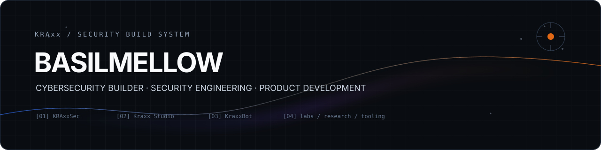

  

# Mohamed Basil

I'm Mohamed Basil, also known as **Basilmellow**. I build security tools, web applications, and practical labs. My work brings together browser security, detection, automation, and the engineering needed to turn an experiment into something people can use.

**KRAxx** is the home for my personal projects. Here you'll find what I'm building, the decisions behind it, and the limits of what each project currently does.

[Website](https://kraxxsec.com) · [LinkedIn](https://www.linkedin.com/in/mohamed-basil-966a8225a/) · [KraxxDeceit demo](https://kraxxdeceit.kraxxsec.com/demo)

## Featured projects

### KraxxDeceit — browser security research

A controlled research application for running browser experiments in disposable sandboxes and inspecting the evidence they produce.

- Fixed prompt-injection and neutral-control scenarios with deterministic execution by default.
- Browser observations, bounded process/socket telemetry, timelines, evidence graphs, and hypotheses collected into portable cases.
- Four-run comparison studies with resumable local progress, plus PDF, JSON, Markdown, CSV, and ZIP exports across case and study workflows.
- Invite-only private case storage with authentication, owner isolation, and database access policies.

The public demo uses synthetic fixtures. Arbitrary public URL scanning is disabled, and optional free AI research remains experimental. Recorded evidence and hypotheses are presented separately.

**Built with:** TypeScript, Next.js, React, Playwright, Vercel Sandbox, Supabase, and Redis.

[Source code](https://github.com/Basilmellow/KraxxDeceit) · [Try the demo](https://kraxxdeceit.kraxxsec.com/demo) · [Visitor guide](https://kraxxdeceit.kraxxsec.com/guide)

### KraxxBot — Discord bot and dashboard

A multi-server Discord bot with a web dashboard. My work on it includes server-scoped permissions, automation, and keeping each server's configuration and actions isolated.

**Built with:** TypeScript, Node.js, Next.js, Prisma, and PostgreSQL.

[Open the dashboard](https://kraxxbot.kraxxsec.com/login)

## Labs and other work

| Project | Focus |
| --- | --- |
| **MindSec Compliance Simulation Lab** | A lab for mapping ISO 27001, PCI DSS, NIST CSF, and CIS Controls through risk assessments, documentation, and policy templates. |
| **MindSec Splunk Lab** | Hands-on SIEM and detection engineering practice using Splunk. |
| **SAMS / LSEMS Portal** | A web portal and internal tools for a roleplay emergency-services organization. |
| **[Kraxx Studio](https://kraxxstudio.com)** | My digital product and web engineering work. |

## What I work with

**Development:** TypeScript, JavaScript, Python, React, Next.js, Node.js, and PostgreSQL.  
**Infrastructure:** Git, Docker, Linux, and cloud deployment.  
**Security practice:** web security, Burp Suite, Splunk, detection engineering, CTFs, and compliance simulation labs.

I'm especially interested in making security behavior easier to inspect: what ran, what was observed, which conclusions the evidence supports, and where uncertainty remains.

## Current focus

- Improving KraxxDeceit's research workflows and reproducibility.
- Developing KraxxBot's automation and dashboard while preserving server isolation.
- Documenting practical security work through labs and project write-ups.

## Connect

Find my projects at [kraxxsec.com](https://kraxxsec.com), or connect with me on [LinkedIn](https://www.linkedin.com/in/mohamed-basil-966a8225a/).

For project questions or reproducible bugs, use the relevant repository's issue tracker. Please keep credentials and private evidence out of public issues.
